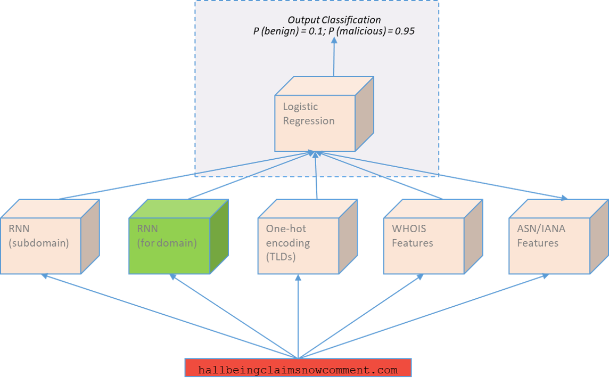

# Character-based DGA Detection

This is a multi-component Domain Generated Algorithm (DGA) detection model. The model leverages Python and well-known libraries such as Pandas, PyTorch and Scitkit-learn. Domain strings are broken down at the character-level to build embeddings whilst reputation-based features are also gathered to give a holistic representation of both benign and malicious domains.

## Architecture



## Setup

Create virtual environment

```bash
conda env create --file local_env.yml
```

Activate and deactivate environment
```bash
conda activate local_dga
conda deactivate
```
Add environment to Jupyter Notebook
```bash
python -m ipykernel install --user --name=local_dga
```

Install latest pytorch for local and cpu only
```bash
conda install pytorch torchvision cpuonly -c pytorch
```

Install necessary packages (On your VM)
```bash
pip install -r gpu_requirements.txt
```

## References

*DGA 2016, Andrew Waeva, accessed 26 February 2020, https://github.com/andrewaeva/DGA.*

*Detecting DGA domains with recurrent neural networks and side information, Curtin, Gardner, Grzonkowski, Kleymenov, and Mosquera. 2019, accessed 26 February 2020, https://arxiv.org/pdf/1810.02023.pdf.*

